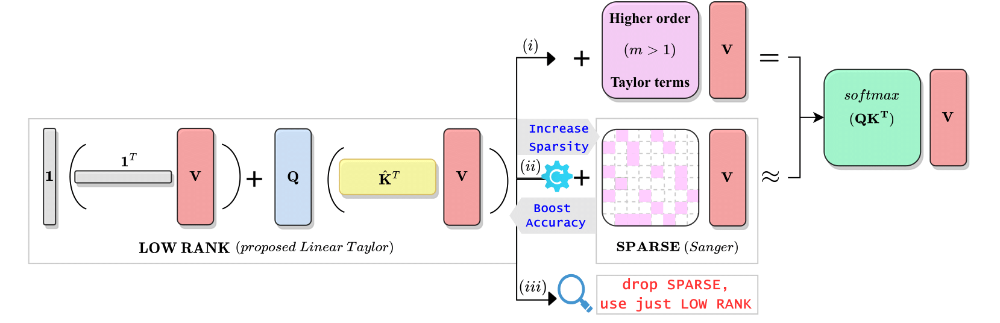
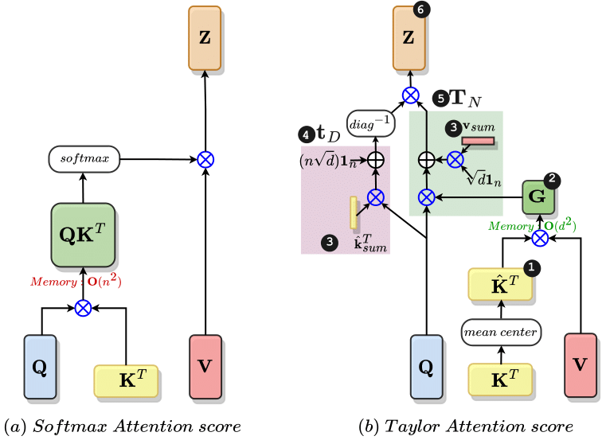
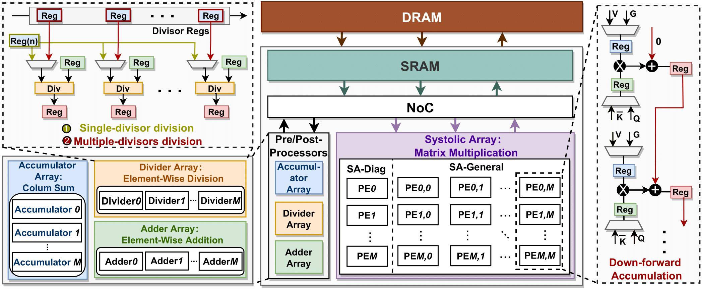

# ViTALiTy: Unifying Low-rank and Sparse Approximation for Vision Transformer Acceleration with a Linear Taylor Attention

Jyotikrishna Dass*, Shang Wu*, Huihong Shi*, Chaojian Li, Zhifan Ye, Zhongfeng Wang and Yingyan Lin

(*Equal contribution)

Accepted by [HPCA 2023](https://hpca-conf.org/2023/). More Info:
\[ [**Paper**](https://arxiv.org/abs/2211.05109) | [**Slide**]() | [**GitHub**](https://github.com/GATECH-EIC/ViTaLiTy) \]

---

## Overview of the ViTALiTy Framework

We propose a low-rank and sparse approximation algorithm and accelerator co-design framework dubbed ViTALiTy.

* ***On the algorithm level***, we propose a linear attention for reducing the computational and memory cost by decoupling the vanilla softmax attention into its corresponding “weak” and “strong” Taylor attention maps. Unlike the vanilla attentions, the linear attention in VITALITY generates a global context matrix G by multiplying the keys with the values. Then, we unify the low-rank property of the linear attention with a sparse approximation of “strong” attention for training the ViT model. Here, the low-rank component of our VITALITY attention captures global information with a linear complexity, while the sparse component boosts the accuracy of linear attention model by enhancing its local feature extraction capacity.

* ***On the hardware level***, we develop a dedicated accelerator to better leverage the algorithmic properties of VITALITY’s linear attention, where only a low-rank component is executed during inference favoring hardware efficiency. Specifically, VITALITY’s accelerator features a chunk-based design integrating both a systolic array tailored for matrix multiplications and pre/post-processors customized for VITALITY attentions’ pre/post-processing steps. Furthermore, we adopt an intra-layer pipeline design to leverage the intra-layer data dependency for enhancing the overall throughput together with a down-forward accumulation dataflow for the systolic array to improve hardware efficiency.

## How to run?
### Environment set up

    pip install -r requirment.txt
### Training (DeiT-Tiny with vanilla softmax)
    cd src
    python -m torch.distributed.launch --nproc_per_node=8 --use_env main.py --model deit_tiny_patch16_224 --lr 1e-4 --epochs 300 --batch-size 256 --data-path YOUR IMAGENET PATH --output_dir ''
### Training (DeiT-Tiny with Vitality)
    cd src
    python -m torch.distributed.launch --nproc_per_node=8 --use_env main.py --model deit_tiny_patch16_224 --lr 1e-4 --epochs 300 --batch-size 256 --data-path YOUR IMAGENET PATH --output_dir '' --vitality
### Inference (DeiT-Tiny with vanilla softmax)
    cd src
    python -m torch.distributed.launch --nproc_per_node=8 --use_env main.py --model deit_tiny_patch16_224 --lr 1e-4 --batch-size 256 --data-path YOUR IMAGENET PATH --output_dir '' --eval
### Inference (DeiT-Tiny with Vitality)
    cd src
    python -m torch.distributed.launch --nproc_per_node=8 --use_env main.py --model deit_tiny_patch16_224 --lr 1e-4 --batch-size 256 --data-path YOUR IMAGENET PATH --output_dir '' --vitality --eval

## Acknowledgment
This codebase is inspired from https://github.com/facebookresearch/deit